The starter project contains 20 colour palette CSS files. 

The starter project is set up to use `default.css`, which is a greyscale colour palette.

**Find:** In the `<head></head>` element of `index.html`, find the line of code that links to `default.css`:

--- code ---
---
language: html
filename: index.html
line_numbers: true
line_number_start: 19
line_highlights: 23
---

 <!-- Include CSS style file -->

     <link href="style.css" rel="stylesheet" type="text/css" /> 
     <link href="animation.css" rel="stylesheet" type="text/css" /> 
     <link href="default.css" rel="stylesheet" type="text/css" /> 
  </head>

--- /code ---

Change the filename in the link to use the CSS filename of the colour palette you want to use. 

--- code ---
---
language: html
filename: index.html
line_numbers: true
line_number_start: 19
line_highlights: 23
---

 <!-- Include CSS style file -->

     <link href="style.css" rel="stylesheet" type="text/css" /> 
     <link href="animation.css" rel="stylesheet" type="text/css" /> 
     <link href="fiesta.css" rel="stylesheet" type="text/css" /> 
  </head>

--- /code ---

Below is a list of all the included colour palettes and their filenames.

## Cafe

filename: cafe.css

## Comic

filename: comic.css

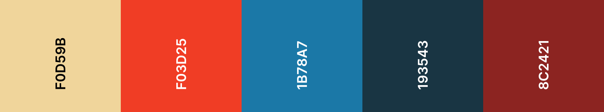

## Companion

filename: companion.css

## Disco

filename: disco.css

## Festival

filename: festival.css

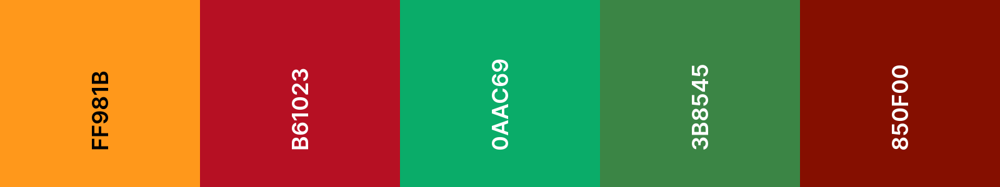

## Fiesta

filename: fiesta.css

## Helpful plumber

filename: helpful-plumber.css

## Land animals

filename: land-animals.css

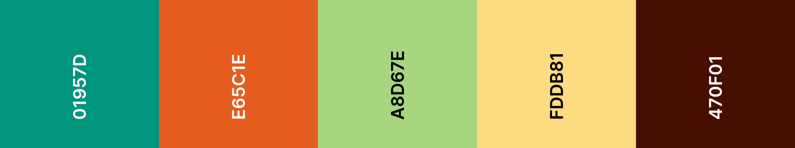

## Medals

filename: medals.css

## Money

filename: money.css

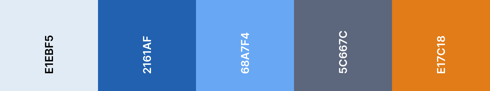

## Nature

filename: nature.css

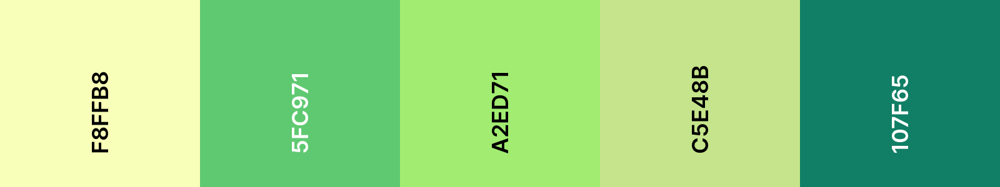

## Pastel

filename: pastel.css

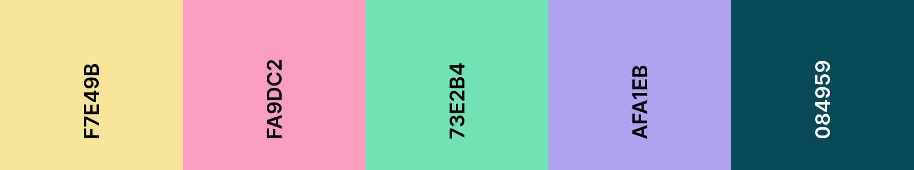

## Primary

filename: primary.css

## Smokey

filename: smokey.css

## Space

filename: space.css

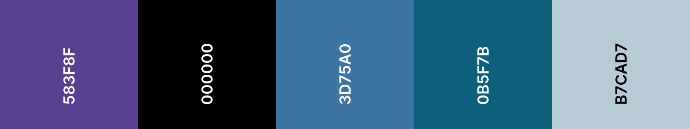

## Sunset

filename: sunset.css

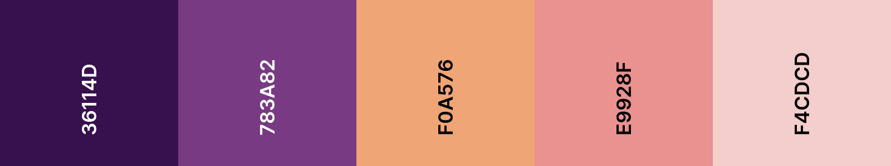

## Sunshine

filename: sunshine.css

## Thriller

filename: thriller.css

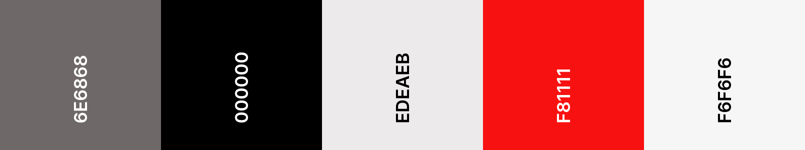

## Water animals

filename: water-animals.css

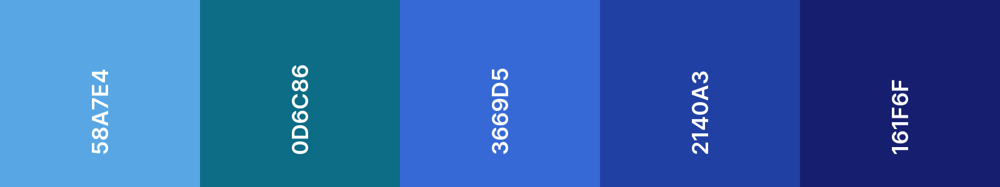

## Woodland

filename: woodland.css

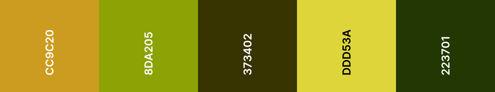

