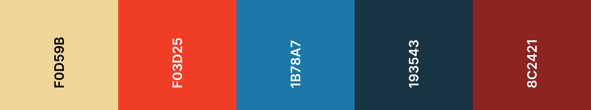
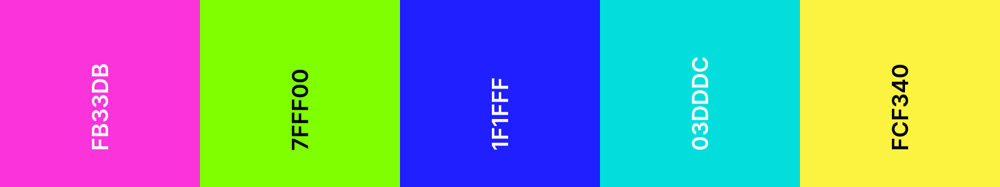
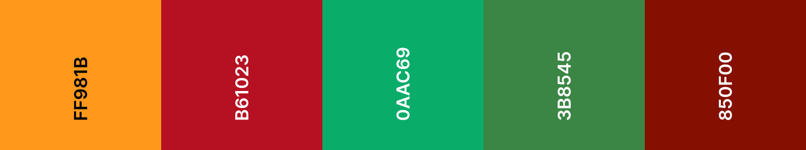
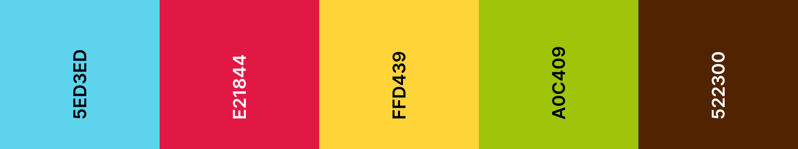
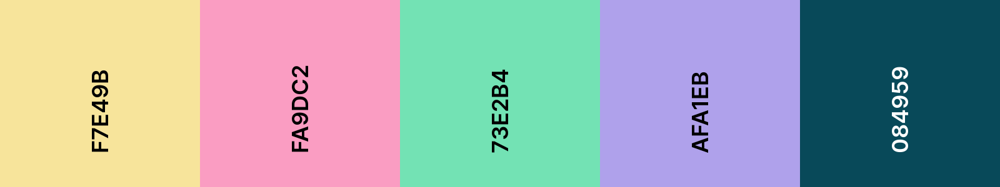
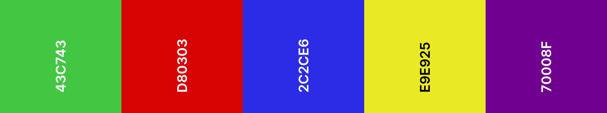
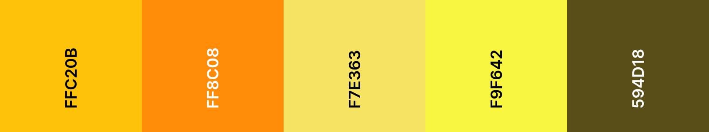
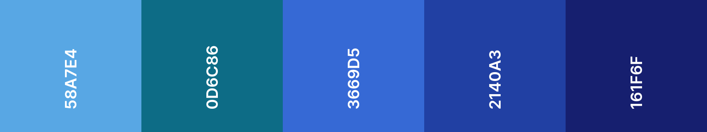
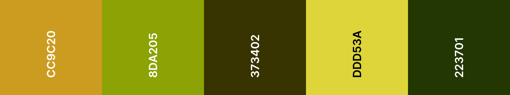

El proyecto inicial contiene 20 archivos CSS de paleta de colores.

El proyecto inicial está configurado para utilizar `default.css`, que es una paleta de colores en escala de grises.

**Buscar:** En el elemento `<head></head>` de `index.html`, busca la línea de código que enlaza a `default.css`.

--- code ---
---
language: html
filename: index.html
line_numbers: true
line_number_start: 19
line_highlights: 23
---

 <!-- Incluir archivo de estilo CSS -->

 <link href="style.css" rel="stylesheet" type="text/css" /> 
 <link href="animation.css" rel="stylesheet" type="text/css" /> 
 <link href="default.css" rel="stylesheet" type="text/css" /> 
  </head>

--- /code ---

Cambia el nombre del archivo en el enlace para utilizar el nombre de archivo CSS de la paleta de colores que deseas utilizar.

--- code ---
---
language: html
filename: index.html
line_numbers: true
line_number_start: 19
line_highlights: 23
---

 <!--- Incluir archivo de estilo CSS --->

     <link href="style.css" rel="stylesheet" type="text/css" /> 
     <link href="animation.css" rel="stylesheet" type="text/css" /> 
     <link href="fiesta.css" rel="stylesheet" type="text/css" /> 
  </head>

--- /code ---

A continuación se muestra una lista de todas las paletas de colores incluidas y sus nombres de archivo.

## Café

nombre de archivo: cafe.css

## Cómic

nombre de archivo: comic.css

## Compañero

nombre de archivo: companion.css

## Disco

nombre de archivo: disco.css

## Festival

nombre de archivo: festival.css

## Fiesta

nombre de archivo: fiesta.css

## Fontanero servicial

nombre de archivo: helpful-plumber.css

## Animales terrestres

nombre de archivo: land-animals.css

## Medallas

nombre de archivo: medals.css

## Dinero

nombre de archivo: money.css

## Naturaleza

nombre de archivo: nature.css

## Pastel

nombre de archivo: pastel.css

## Primarios

nombre de archivo: primary.css

## Ahumado

nombre de archivo: smokey.css

## Espacio

nombre de archivo: espacio.css

## Atardecer

nombre de archivo: sunset.css

## Luz del Sol

nombre de archivo: sunshine.css

## Suspenso

nombre de archivo: thriller.css

## Animales acuáticos

nombre de archivo: animales-acuáticos.css

## Bosque

nombre de archivo: woodland.css

