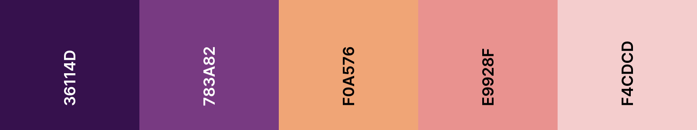

Le projet de démarrage contient 20 fichiers CSS de palette de couleurs.

Il est configuré pour utiliser `default.css`, qui est une palette de couleurs en niveaux de gris.


**Find:** In the `<head></head>` element of `index.html`, find the line of code that links to `default.css`.

## --- code ---

language: html
filename: index.html
line_numbers: true
line_number_start: 19
line_highlights: 23
--------------------------------------------------------

 <!-- Include CSS style file -->

```
 <link href="style.css" rel="stylesheet" type="text/css" /> 
 <link href="animation.css" rel="stylesheet" type="text/css" /> 
 <link href="default.css" rel="stylesheet" type="text/css" /> 
```

  </head>

\--- /code ---

Change le nom de fichier dans le lien pour utiliser le nom de fichier CSS de la palette de couleurs que tu veux utiliser.

## --- code ---

language: html
filename: index.html
line_numbers: true
line_number_start: 19
line_highlights: 23
--------------------------------------------------------

 <!-- Include CSS style file -->

```
 <link href="style.css" rel="stylesheet" type="text/css" /> 
 <link href="animation.css" rel="stylesheet" type="text/css" /> 
 <link href="fiesta.css" rel="stylesheet" type="text/css" /> 
```

  </head>

\--- /code ---

Tu trouveras ci-dessous une liste de toutes les palettes de couleurs incluses et leur nom de fichier.

## Cafe

nom de fichier : cafe.css


## Comic

nom de fichier : comic.css


## Companion

nom de fichier : companion.css


## Disco

nom de fichier : disco.css


## Festival

nom de fichier : festival.css


## Fiesta

nom de fichier : fiesta.css


## Helpful plumber

nom de fichier : helpful-plumber.css


## Land animals

nom de fichier : land-animals.css

!Cinq nuances de vert, orange, jaune et noir.](images/land-animals.png)

## Medals

nom de fichier : medals.css


## Money

nom de fichier : money.css


## Nature

nom de fichier : nature.css


## Pastel

nom de fichier : pastel.css


## Primary

nom de fichier : primary.css


## Smokey

nom de fichier : smokey.css


## Space

nom de fichier : space.css


## Sunset

nom de fichier : sunset.css



## Sunshine

nom de fichier : sunshine.css


## Thriller

nom de fichier : thriller.css


## Water animals

nom de fichier : water-animals.css


## Woodland

nom de fichier : woodland.css


