Het startproject bevat 20 CSS-bestanden met kleurenpaletten.

Het startproject is ingesteld om `default.css` te gebruiken, wat een grijswaardenkleurenpalet is.

**Zoek:** Zoek in het `<head></head>` element van `index.html` de coderegel die linkt naar `default.css`.

--- code ---
---
language: html
filename: index.html
line_numbers: true
line_number_start: 19
line_highlights: 23
---

 <!-- Voeg een CSS-stijlbestand toe -->

 <link href="style.css" rel="stylesheet" type="text/css" /> 
 <link href="animation.css" rel="stylesheet" type="text/css" /> 
 <link href="default.css" rel="stylesheet" type="text/css" /> 
  </head>

--- /code ---

Wijzig de bestandsnaam in de link om de CSS-bestandsnaam te gebruiken van het kleurenpalet dat je wilt gebruiken.

--- code ---
---
language: html
filename: index.html
line_numbers: true
line_number_start: 19
line_highlights: 23
---

 <!-- Voeg een CSS-stijlbestand toe -->

 <link href="style.css" rel="stylesheet" type="text/css" /> 
 <link href="animation.css" rel="stylesheet" type="text/css" /> 
 <link href="fiesta.css" rel="stylesheet" type="text/css" /> 
  </head>

--- /code ---

Hieronder vind je een lijst met alle meegeleverde kleurenpaletten en hun bestandsnamen.

## Café

bestandsnaam: cafe.css

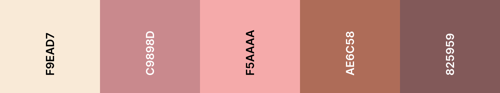

## Grappig

bestandsnaam: comic.css

## Companion

bestandsnaam: companion.css

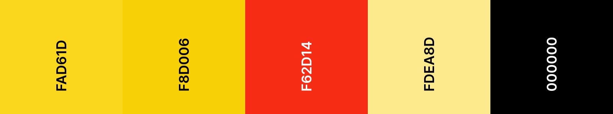

## Disco

bestandsnaam: disco.css

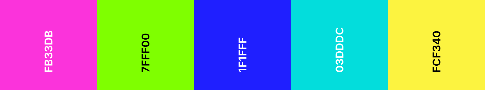

## Festival

bestandsnaam: festival.css

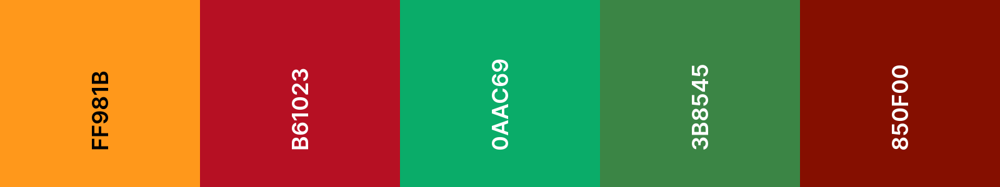

## Feest

bestandsnaam: fiesta.css

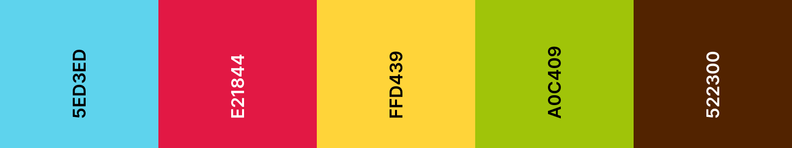

## Nuttige loodgieter

bestandsnaam: helpful-plumber.css

## Landdieren

bestandsnaam: land-animals.css

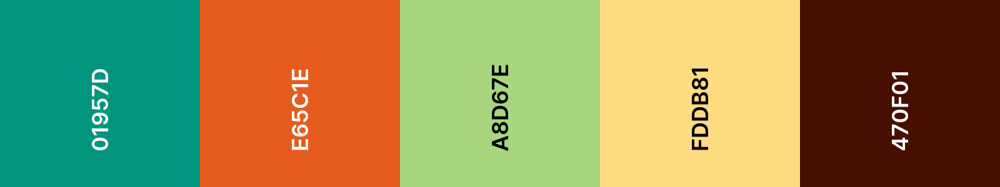

## Medailles

bestandsnaam: medals.css

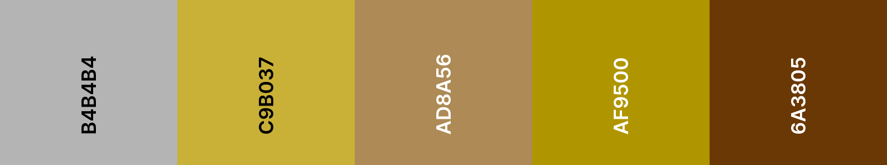

## Geld

bestandsnaam: money.css

## Natuur

bestandsnaam: nature.css

## Pastel

bestandsnaam: pastel.css

## Primair

bestandsnaam: primary.css

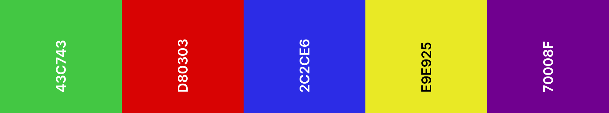

## Rokerig

bestandsnaam: smokey.css

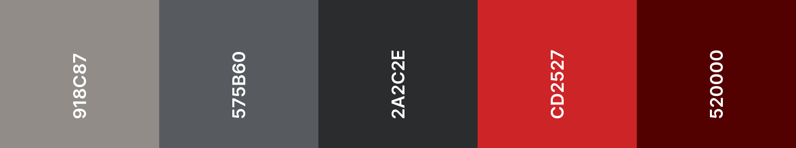

## Ruimte

bestandsnaam: space.css

## Zonsondergang

bestandsnaam: sunset.css

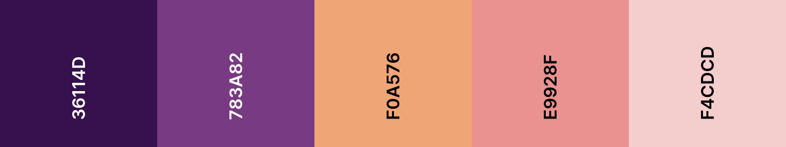

## Zonneschijn

bestandsnaam: sunshine.css

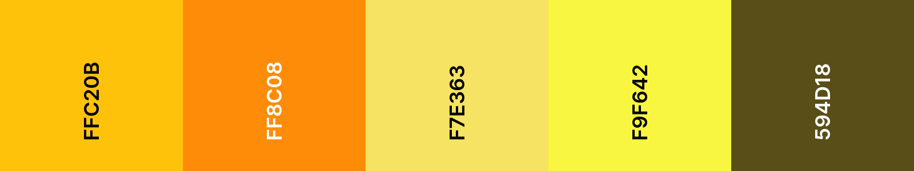

## Thriller

bestandsnaam: thriller.css

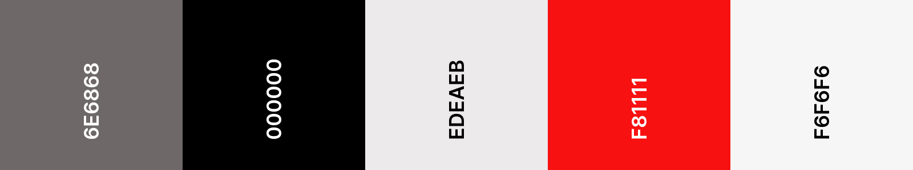

## Waterdieren

bestandsnaam: water-animals.css

## Bos

bestandsnaam: woodland.css

