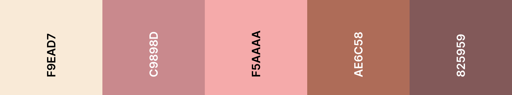
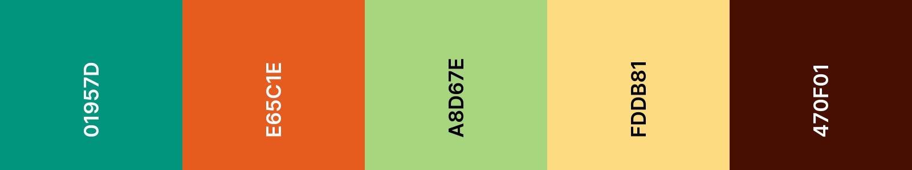
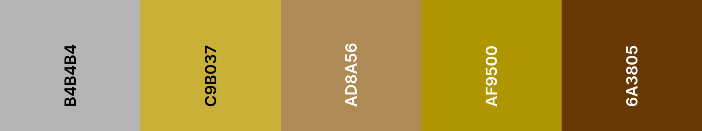
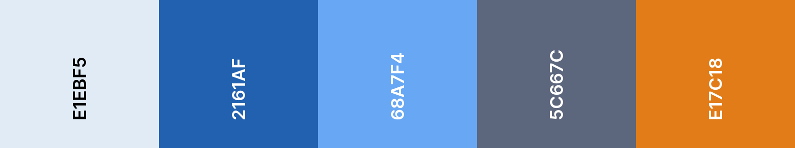
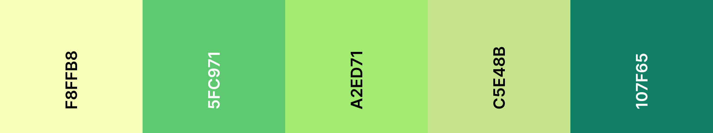
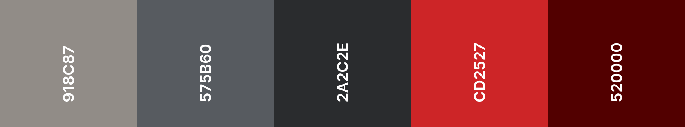
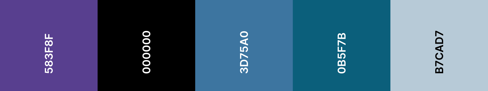
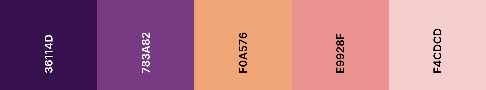
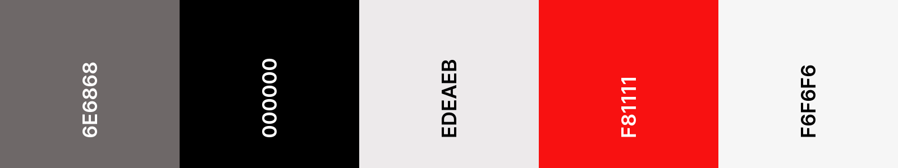

Початковий проєкт містить 20 CSS-файлів з палітрами кольорів.

Стартовий проєкт налаштовано на використання `default.css`, що є палітрою кольорів у градаціях сірого.

**Знайди** в елементі `<head></head>` файлу `index.html` рядок коду, який посилається на `default.css`.

--- code ---
---
language: html
filename: index.html
line_numbers: true
line_number_start: 19
line_highlights: 23
---

 <!-- Додаємо файл стилів CSS -->

     <link href="style.css" rel="stylesheet" type="text/css" /> 
     <link href="animation.css" rel="stylesheet" type="text/css" /> 
     <link href="default.css" rel="stylesheet" type="text/css" /> 
  </head>

--- /code ---

Зміни назву файлу в посиланні на назву CSS-файлу потрібної палітри кольорів.

--- code ---
---
language: html
filename: index.html
line_numbers: true
line_number_start: 19
line_highlights: 23
---

 <!-- Додаємо файл стилів CSS -->

     <link href="style.css" rel="stylesheet" type="text/css" /> 
     <link href="animation.css" rel="stylesheet" type="text/css" /> 
     <link href="fiesta.css" rel="stylesheet" type="text/css" /> 
  </head>

--- /code ---

Нижче наведено список усіх наявних палітр кольорів та назв їхніх файлів.

## Кафе

Назва файлу: cafe.css

## Комікс

Назва файлу: comic.css

## Компаньйон

Назва файлу: companion.css

## Дискотека

Назва файлу: disco.css

## Свято

Назва файлу: festival.css

## Фієста

Назва файлу: fiesta.css

## Завзятий сантехнік

Назва файлу: helpful-plumber.css

## Наземні тварини

Назва файлу: land-animals.css

## Досягнення

Назва файлу: medals.css

## Гроші

Назва файлу: money.css

## Природа

Назва файлу: nature.css

## Пастель

Назва файлу: pastel.css

## Основні кольори

Назва файлу: primary.css

images/primary.png

## Димок

Назва файлу: smokey.css

## Космос

Назва файлу: space.css

## Захід сонця

Назва файлу: sunset.css

## Сонячне проміння

Назва файлу: sunshine.css

## Трилер

Назва файлу: thriller.css

## Водні тварини

Назва файлу: water-animals.css

## Ліс

Назва файлу: woodland.css

